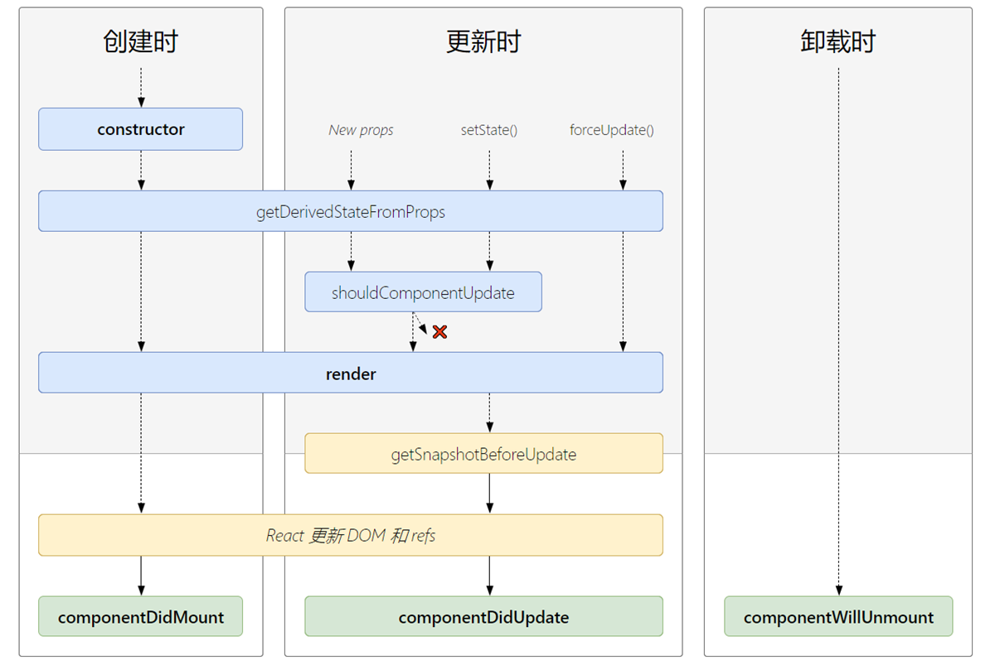

## 第一章 基础语法

### JSX语法

#### 介绍

JSX就是Javascript和XML结合的一种格式。React发明了JSX，利用HTML语法来创建虚拟DOM。当遇到<，JSX就当HTML解析，遇到{就当JavaScript解析。

#### 实例

const element = <h1>Hello World</h1>;

#### JSX中的表达式

const num = 100;
const element = <h1>{num}</h1>;

#### react元素

- 实际上是一个普通元素

```javascript
let eleObj = {
	type : 'div',
	props : {
		children : ['hello','world'],
		className : 'red',
		id : 'box'
	}
}
```

#### Babel编译

- 把 JSX 转换成一个名为 React.createElement( ) 的方法调用，返回 JavaScript 对象
- React.createElement( type（元素名称） [, props（元素属性）] [, ...children（子节点）] )

### 元素渲染

#### 过程


##### 根dom节点

- <div id=‘root’></div>
- 接地点所有内容由reactdom管理

##### 元素渲染

- 将 React 元素传递给 ReactDOM.render( ) 方法将其渲染到页面上
- ReactDOM.render(ele,document.getElementById('root'));

##### 更新渲染元素

- React 元素是不可变的
- React 元素被创建后，无法改变其内容或属性
- **使用 React 的 DOM 比较算法进行高效的更新**

```javascript
function tick() { 
	const ele = <div>{new Date( ).toLocaleTimeString( )}</div> ; 	ReactDOM.render(ele, document.getElementById('root')); 
} 
setInterval(tick, 1000);
```

#### 组件

##### 概念

- React组件是小的，可复用的代码片段
- 从概念上看像是函数，接受任意的输入值（‘props’），返回一个react元素用于渲染页面

##### 定义方式

###### 函数定义

- 接收单一的 props 对象，返回一个 React 元素
- props 是组件的输入内容， 从父组件传递给子组件的数据(属性)
- 注意：**props 是只读的；组件名称必须以大写字母开头**

```javascript
function Hello( props ) { 
	return <h1>Hello { props.name }</h1>
} 
ReactDOM.render(
	<Hello name=“ React ”/>, document.getElementById('root')
);
```

###### 类定义

- React 提供了 React.Component  抽象基础类
- 直接引用 React.Component  几乎没意义，通常是继承它至少定义一个 render( ) 方法

```javascript
class Hello extends React.Component { 
	render( ) { 
		return <h1>Hello, {this.props.name}</h1>; 
	} 
}
```

###### State（状态）

- 私有的、完全受控于当前组件，组件外部是无法进行修改的
- 类定义的组件特有的属性
- 状态的声明（构造函数是唯一能够初始化 this.state 的地方）

```javascript
class Hello extends React.Component { 
	constructor( ){         // ES6 对类的默认方法
		super();        // 将父类中的 this 对象继承给子类
		this.state = {name:’React’}
	}
	render( ) { return <h1>Hello { this.state.name }</h1>; } 
}
```

##### 组件生命周期



###### 生命周期函数

- 指在某一个时刻组件会自动执行的函数
- 只在类定义的组件中才有生命周期函数，函数方式定义的没有

周期生命周期包含的阶段
- 初始化
constructor( )
会在其装载之前被调用
在函数内应该在任何其他的表达式之前调用super(props)，否则，this.props  在构造函数中将是未定义的
作用：
初始化状态，通过赋值一个对象到 this.state
绑定事件处理函数到一个实例

- 挂载
getDerivedStateFromProps( )
组件实例化后或接受新属性时将会被调用
应该返回一个对象来更新状态，或者返回 null 来表明新属性不需要更新任何状态
render( )  类组件唯一必须的方法
componentDidMount( )  组件挂载后立即调用，发送请求的好地方

- 更新
getDerivedStateFromProps( )
shouldComponentUpdate( )  当接收到新属性或状态时，在渲染前被调用，返回布尔值
getSnapshotBeforeUpdate( )
在最新的渲染输出提交给 DOM 前将会立即调用
该函数返回的任何值将会 作为参数被传递给componentDidUpdate
componentDidUpdate( )

- 卸载
componentWillUnmount( )

- 错误
componentDidCatch( )

#### 事件处理

##### 事件绑定

- React 事件绑定属性的命名采用驼峰式写法，而不是小写
- 采用 JSX 语法需传入一个函数作为事件处理函数，而不是一个字符串( DOM 元素的写法 )

```javascript
handleClick = ( ) => { }
….
<button onClick={ handleClick }> 
	Click 
</button>
```

##### 事件处理函数绑定 this

- 类的方法默认是不会绑定 this 的
- 通过 bind 绑定 this（ 两种形式 ）

```javascript
constructor( ){        
	super();     
	this.handleClick = this.handleClick.bind( this );
}
<button onClick={ this.handleClick.bind( this ) }> 
	Click 
</button>
```

